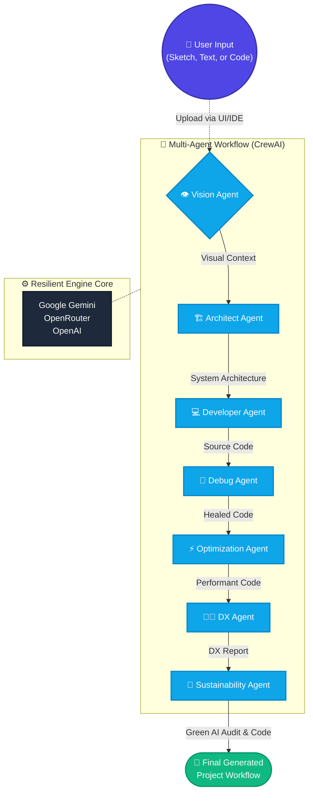
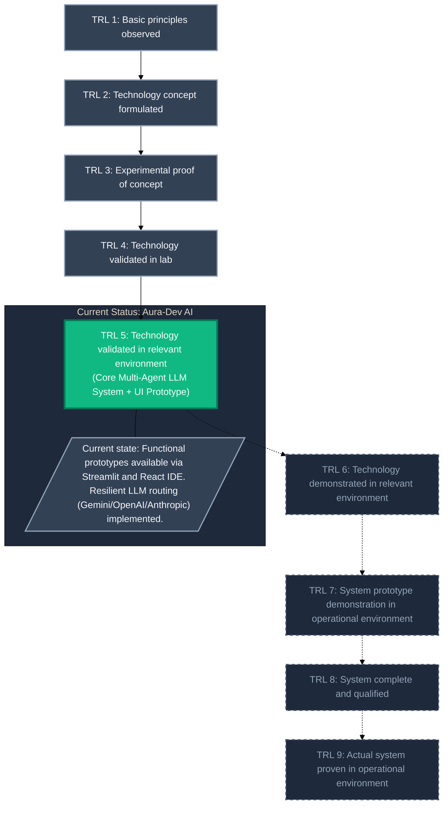

# Aura-Dev AI 🚀

Aura-Dev AI is a multi‑agent development copilot that automates large parts of the software lifecycle.  
It uses **CrewAI** agents orchestrated over a **resilient LLM engine** (Google Gemini, OpenRouter, OpenAI) to go from sketch → architecture → code → self‑healing → optimization → audits.



## 🌟 Key Features

- Multi-agent orchestration: Vision, Architect, Developer, Debug, Optimization, DX, and Sustainability agents.
- Resilient LLM engine: Nuclear‑tier key & model rotation for Gemini / OpenRouter / OpenAI.
- Vision integration: Turn UI sketches into working projects from hand‑drawn or Figma‑style mockups.
- Browser UIs:
  - Streamlit dashboard (`app.py`) for quick experiments.
  - Vite + React IDE (`frontend/`) talking to a FastAPI backend (`backend/`).

## TRL LEVEL



## 🏗️ Project Structure

```text
visionlink/
├── app.py              # Streamlit dashboard (7‑agent workflow)
├── agents.py           # CrewAI agent definitions
├── tasks.py            # CrewAI task definitions
├── crew_flow.py        # CrewAI orchestration (7‑agent crew)
├── direct_flow.py      # Direct, streaming 7‑phase flow (used by backend)
├── resilient_engine.py # Hardened LangChain LLM wrapper
├── tools.py            # Custom CrewAI tools (file writer, file lister)
├── backend/
│   └── main.py         # FastAPI backend (Aura IDE API)
├── frontend/           # Vite + React frontend (Aura IDE)
├── generated_project/  # Output folder for generated code
└── venv/               # Python virtualenv (local)
```

## 🔧 Prerequisites

- Python 3.10+
- Node.js + npm (for the React frontend)
- LLM API keys in `.env`:
  - `GOOGLE_API_KEY`, optionally `GOOGLE_API_KEY_2` … `GOOGLE_API_KEY_8`
  - `OPENROUTER_API_KEY` (optional, for OpenRouter)
  - `OPENAI_API_KEY` (optional, for OpenAI)

## ⚙️ Setup

1. Clone & enter the project (if not already):

   ```bash
   git clone https://github.com/Pranesh003/Aura-Dev-AI.git
   cd Aura-Dev-AI
   ```

2. Create & activate a virtualenv:

   ```bash
   python -m venv venv
   # Windows
   venv\Scripts\activate
   # macOS / Linux
   source venv/bin/activate
   ```

3. Install Python dependencies:

   ```bash
   pip install -r requirements.txt
   ```

4. Configure environment variables in a `.env` at the repo root:

   ```env
   GOOGLE_API_KEY=your_gemini_key
   GOOGLE_API_KEY_2=optional_second_key
   GOOGLE_API_KEY_3=...
   OPENROUTER_API_KEY=optional_openrouter_key
   OPENAI_API_KEY=optional_openai_key
   ```

5. Install frontend dependencies (once):

   ```bash
   cd frontend
   npm install
   cd ..
   ```

## 🌐 Running the Agent in the Browser

### Option A — Aura IDE (React + FastAPI) ✅

1. Start the backend (FastAPI) from the project root:

   ```bash
   # With the virtualenv activated
   python backend/main.py
   ```

   This starts the API on `http://localhost:8000`.

2. Start the frontend (Vite + React) in another terminal:

   ```bash
   cd frontend
   npm run dev
   ```

   Vite will display a URL like `http://localhost:5173`.  
   Open it in your browser to use the Aura IDE, trigger the 7‑agent flow, and inspect generated files under `generated_project/`.

### Option B — Streamlit Dashboard (Quick Mode)

From the project root, with the virtualenv activated:

```bash
streamlit run app.py
```

or:

```bash
python -m streamlit run app.py
```

Then open `http://localhost:8501` in your browser.  
Upload a system sketch, describe your project, and click **“🚀 Run Aura-Dev (7-Agent Core Mode)”** to launch the full agentic workflow.

## 🤖 Agents & Roles (High Level)

- Vision Agent – Turns UI sketches into detailed visual/structural context.
- Architect Agent – Expands context into a multi‑layer architecture with diagrams.
- Developer Agent – Generates a full project into `generated_project/`.
- Debug Agent – Self‑heals and refactors code, writing `debug_report.md`.
- Optimization Agent – Reduces dependency/runtimes overhead.
- DX Agent – Audits cognitive load and developer experience.
- Sustainability Agent – Performs a Green‑AI audit and impact report.

## 📄 License

This project is licensed under the MIT License – see `LICENSE` for details.

Built with ❤️ by [Pranesh003](https://github.com/Pranesh003)
