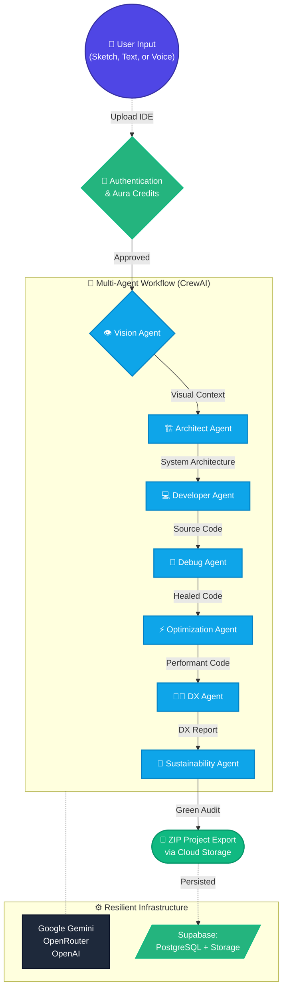

# Aura-Dev AI 🚀

[-10b981?style=for-the-badge)](https://en.wikipedia.org/wiki/Technology_readiness_level)
[](https://python.org)
[](https://fastapi.tiangolo.com)
[](https://react.dev)
[](https://supabase.com)

Aura-Dev AI is an elite **Autonomous Multi-Model Agentic Software Engineering System** designed to automate large parts of the software lifecycle, moving from abstract visual requirements to complete generation.

It leverages a powerful **7-Agent CrewAI Orchestration** over a **Resilient LLM Engine** (Google Gemini, OpenRouter, OpenAI) to go from sketch → architecture → code → self‑healing → optimization → cognitive audits → sustainability reports.

---

## 🌟 Mission & Core Principles

**Mission:** To significantly reduce cognitive load, development time, and resource consumption by transforming abstract requirements into reliable, maintainable, and inclusive software solutions.

**Core Principles:**
- **Modular Reasoning:** Decoupled architect, developer, and auditor flows for clear logic progression.
- **Low-Dependency Engineering:** Built with minimal external dependencies to ensure long-term stability.
- **Self-Validation:** Automatic quota detection, fallback mechanisms, and robust error handling.
- **Developer-Friendly:** Structured file generation with precise parsing and an interactive Vite+React UI.
- **Sustainability:** Optimized API usage and Green-AI computing focus.
- **Inclusivity:** Scaled efficiently ensuring execution even on low-bandwidth setups.

---

## 🤖 The 7-Agent Workflow Team

1. **👁️ Lead Multimodal Vision Architect (Vision Agent)**
   Specialized in converting abstract visual sketches (hand-drawn/Figma) into deep-reasoning engineering blueprints.
2. **🏗️ System Architect (Architect Agent)**
   Expands vision context into a multi-layer modular architecture design.
3. **💻 Senior Full-Stack Developer (Developer Agent)**
   Converts blueprints into production-ready, PEP8-compliant, and secure source code.
4. **🐛 Autonomous Debugging Engineer (Debug Agent)**
   Enhances productivity by detecting and healing syntax errors, missing imports, and logic bottlenecks directly in the newly generated code.
5. **⚡ Performance Optimization Specialist (Optimization Agent)**
   Identifies heavy dependencies, reduces runtime overhead, and refactors logic down to high-performance minimalist alternatives.
6. **🧑‍💻 DX & Cognitive Load Expert (DX Agent)**
   Analyzes interaction patterns to natively simplify the system, offering a pristine developer experience.
7. **🍃 Green AI & Sustainability Auditor (Sustainability Agent)**
   Evaluates system efficiency, carbon footprint algorithms, and inclusiveness to ensure absolute "Hackathon Winning Edge" delivery.

---

## 🏗️ Architecture & Execution Flow



### 🚀 Production SaaS Integration (TRL 6+)
Aura-Dev operates as a modern Software-As-A-Service:
- **Scalable Backend:** FastAPI handles background asynchronous task queues.
- **Credit-Based Monetization:** In-built `Aura Credits` deducted strictly per full multi-agent generation run.
- **Supabase Cloud Storage:** Generated projects are securely sandboxed, zipped, inserted into Cloud Buckets (`artifacts/`), and tracked via UUID allowing subsequent secure authorized downloads.

---

## 🔧 Technology Stack

* **Frontend Pipeline**: React (Vite), TailwindCSS (Browser App IDE).
* **AI & Orchestration Engine**: Python, Core CrewAI, Hardened LangChain wrappers over Gemini Pro Vision / Text APIs.
* **Backend API Sandbox**: FastAPI, SQLAlchemy (PostgreSQL ORM), background workers.
* **Database & BaaS**: Supabase (Auth, Object Tracking & Blob Storage for ZIP archives).
* **Local Sandbox**: Streamlit (`app.py` for lightweight/offline immediate interactions).

---

## 📂 Project Structure

```text
visionlink/
├── app.py              # Lightweight Streamlit dashboard (Quick mode)
├── agents.py           # Core CrewAI Prompts/Agents mappings
├── tasks.py            # Expected Output definitions for CrewAI
├── direct_flow.py      # Resilient generation script (Streaming backend)
├── resilient_engine.py # Nuclear-tier error-fallback LLM handler 
├── background/         
│   ├── main.py         # FastAPI App (Authentication, Routers, Supabase logic)
│   ├── routers/        # Resource specific API routes
│   └── models.py       # User / Project schemas
├── frontend/           # The Vite + React Next-Gen Dashboard UI
├── requirements.txt    # Essential python bindings
└── ...
```

---

## ⚙️ Setup & Installation Instructions

### Prerequisites
- Python 3.10+
- Node.js (v16+) and npm
- Valid external platform API Keys.

### 1. Environment Configurations
Clone the reporitory:
```bash
git clone https://github.com/Pranesh003/Aura-Dev-AI.git
cd Aura-Dev-AI
```
Create `.env` at the root folder:
```env
# AI Models
GOOGLE_API_KEY=your_gemini_key
GOOGLE_API_KEY_2=optional_rotation_key
OPENROUTER_API_KEY=optional_openrouter_key
OPENAI_API_KEY=optional_openai_key

# Supabase SaaS Data Layer
SUPABASE_URL=your_supabase_project_url
SUPABASE_KEY=your_supabase_anon_or_service_key
```

### 2. Startup Strategy A - Production IDE (FastAPI + React)

Aura-Dev's primary environment relies on decoupled Front/Back ends.

**Terminal 1 (Backend Initialization & Workers)**
```bash
python -m venv venv
venv\Scripts\activate  # Windows
# or: source venv/bin/activate # Linux/Mac

pip install -r requirements.txt
python backend/main.py
```
*API successfully mounts on `http://localhost:8000`*

**Terminal 2 (Frontend Interface)**
```bash
cd frontend
npm install
npm run dev
```
*IDE bounds to `http://localhost:5173`. Open your browser, authenticate, and begin generating software.*

### 3. Startup Strategy B - Local Diagnostic Interface (Streamlit)

For rapid offline diagnostics without SaaS database triggers:

```bash
# With python VENV activated
streamlit run app.py
```
*Access via `http://localhost:8501`. Upload sketches directly for agent hand-off.*

---

## 📈 Current Technology Readiness (TRL)

Aura-Dev is evaluated at **TRL 6: Technology demonstrated in relevant environment**. 
* The system is fully out of experimental local stages.
* Background queue integrations, Database ORMs, actual deployed cloud-blob interaction (Supabase) are live. 
* Resilient LLM routing achieves high stability against strict ratelimits dynamically.

---

## 📄 License & Maintainer

This project is licensed under the MIT License – see `LICENSE` for details.

Built with logic, efficiency, and sustainability by **[Pranesh003](https://github.com/Pranesh003)**. 🚀
